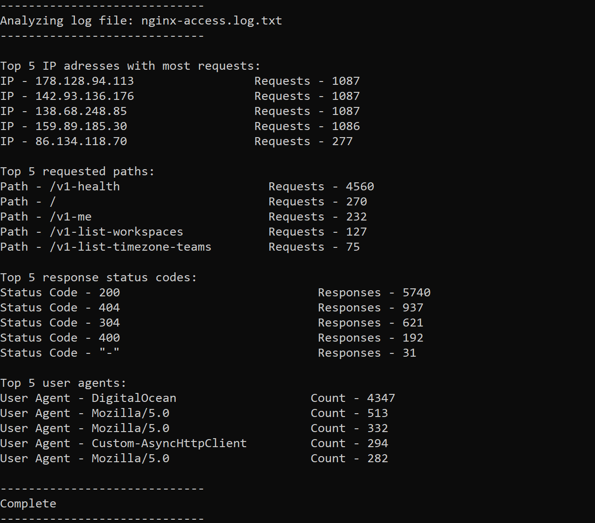

# NGINX Access Log Analyzer (Shell Script)



[Nginx Log Analyzer](https://roadmap.sh/projects/nginx-log-analyser)

This project provides a simple and effective **Bash CLI tool** to analyze an NGINX access log file and generate key traffic statistics from it.

---

## Features

This tool reads an NGINX access log and outputs the following:

- 🔹 **Top 5 IP addresses** making the most requests
- 🔹 **Top 5 requested paths**
- 🔹 **Top 5 HTTP response status codes**
- 🔹 **Top 5 user agents**

It works with the **default NGINX combined log format**. Minor changes may be required for custom formats.

---


## How to Run

```bash
chmod +x analyze_nginx_log.sh
./analyze_nginx_log.sh nginx-access.log.txt
```

---

