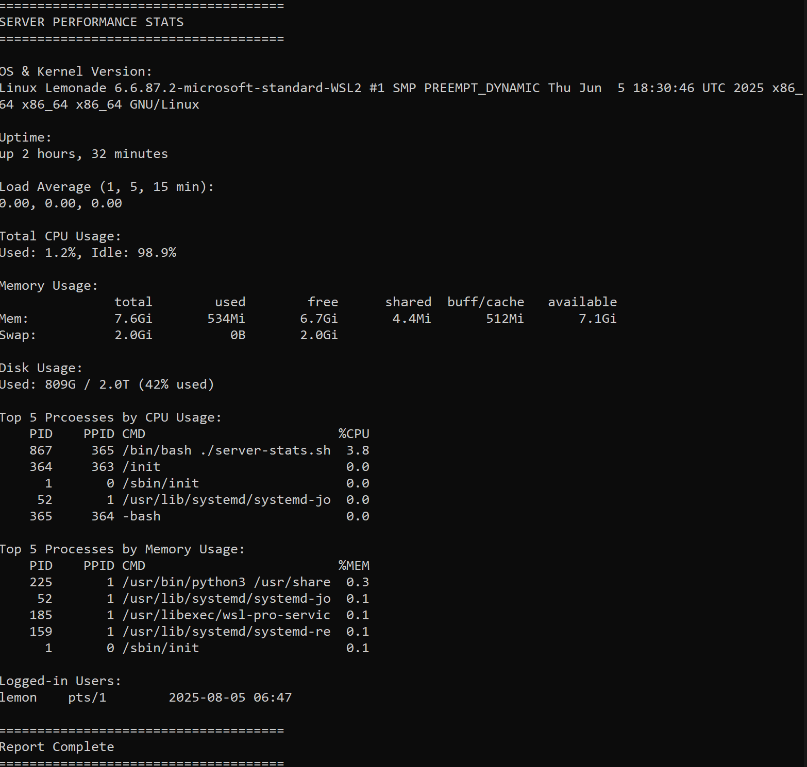

# 🖥️ Server Performance Stats Script

`server-stats.sh` is a lightweight, portable Bash script that provides essential Linux server performance statistics in a readable format. It's ideal for system administrators, DevOps engineers, and curious users who want a quick snapshot of system health.

---

## 📌 Features

The script outputs:

- ✅ **CPU Usage** 
- ✅ **Memory Usage** 
- ✅ **Disk Usage** 
- ✅ **Top 5 CPU-consuming processes**
- ✅ **Top 5 Memory-consuming processes**
- ✅ **OS and Kernel version**
- ✅ **System uptime**
- ✅ **Load average** (1, 5, and 15-minute intervals)
- ✅ **Logged-in users**

---

